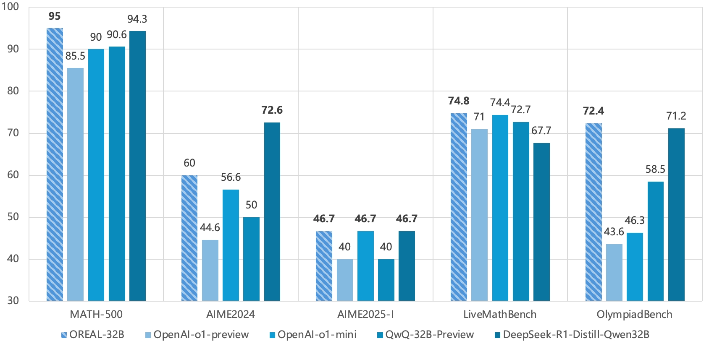
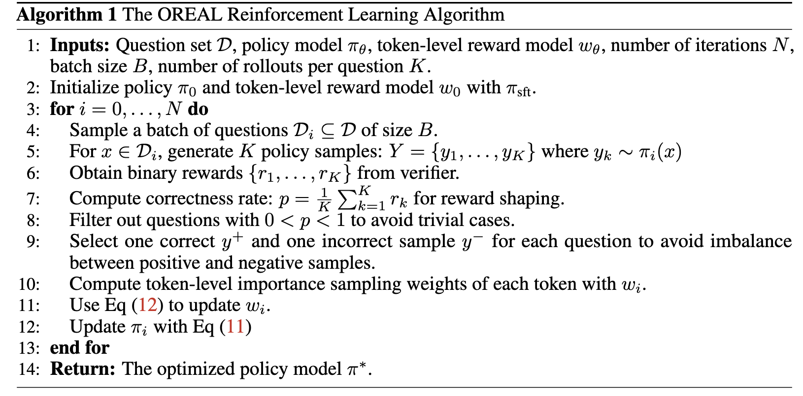
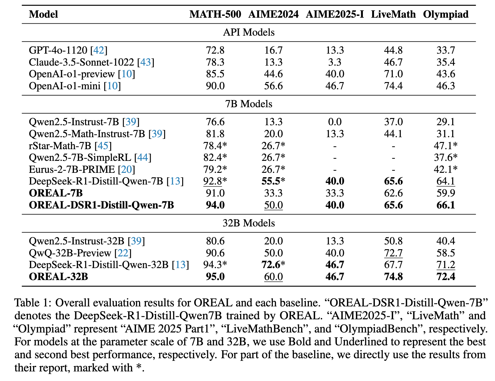

# OREAL: Exploring the Limit of Outcome Reward for Learning Mathematical Reasoning


[](./LICENSE)
[](https://arxiv.org/abs/2502.06781)
[](https://huggingface.co/internlm/OREAL-32B)


## ✨ Introduction



Reasoning abilities, especially those for solving complex math problems, are crucial components of general intelligence.
Recent advances by proprietary companies, such as o-series models of OpenAI, have made remarkable progress on reasoning tasks. However, the complete technical details remain unrevealed, and the techniques that are believed certainly to be adopted are only reinforcement learning (RL) and the long chain of thoughts.

We proposes a new RL framework, termed OREAL, to pursue the performance limit that can be achieved through **O**utcome **RE**w**A**rd-based reinforcement **L**earning for mathematical reasoning tasks, where only binary outcome rewards are easily accessible.

+ We theoretically prove that behavior cloning on positive trajectories from best-of-N (BoN) sampling is sufficient to learn the KL-regularized optimal policy in binary feedback environments.
+ This formulation further implies that the rewards of negative samples should be reshaped to ensure the gradient consistency between positive and negative samples.
+ To alleviate the long-existing difficulties brought by sparse rewards in RL, which are even exacerbated by the partial correctness of the long chain of thought for reasoning tasks, we further apply a token-level reward model to sample important tokens in reasoning trajectories for learning.

The OREAL implementation pseudocode is as follows:




## 📃 Key Results

With OREAL, for the first time, a 7B model can obtain 94.0 pass@1 accuracy on MATH-500 through RL, being on par with 32B models. OREAL-32B also surpasses previous 32B models trained by distillation with 95.0 pass@1 accuracy on MATH-500.



## 🤗 HuggingFace Model Zoo

Our OREAL models are available on Hugging Face 🤗:

| Model    | Huggingface Repo |
|----------|------------------|
| OREAL-7B  | [Model Link](https://huggingface.co/internlm/OREAL-7B)  |
| OREAL-32B  | [Model Link](https://huggingface.co/internlm/OREAL-32B)  |

We also release the models of SFT version. You can construct your own RL pipeline on them:)

| Model    | Huggingface Repo |
|----------|------------------|
| OREAL-7B-SFT  | [Model Link](https://huggingface.co/internlm/OREAL-7B-SFT)  |
| OREAL-32B-SFT  | [Model Link](https://huggingface.co/internlm/OREAL-32B-SFT)  |


## 🚄 Training Tutorial

### 1. Install Dependencies

OREAL utilizes [XTuner](https://github.com/InternLM/xtuner/tree/main) as the training engine. 

```bash
pip install torch==2.5.1 torchvision==0.20.1 torchaudio==2.5.1 --index-url https://download.pytorch.org/whl/cu124
pip install flash-attn --no-build-isolation
pip install -r requirements.txt
```

### 2. Prepare Data (Optional)

The training data can be found at [HERE](https://huggingface.co/datasets/internlm/OREAL-RL-Prompts). The training script will automatically download the data from huggingface.

### 3. Start LLM Verifier Service

OREAL requires a language model as a verifier to evaluate the correctness of the generated solutions along with a rule based verificy function (see the [source code](oreal/judgers/math_judger.py)). We use Qwen2.5-72B-Instruct as the verifier in our experiments. You can start the verifier service with [lmdeploy](https://github.com/InternLM/lmdeploy) by running the following command:

```bash
lmdeploy serve api_server Qwen/Qwen2.5-72B-Instruct --tp 4 --chat-template qwen --log-level INFO --server-port 10003
```

Or you can use any other inference engine such as [sglang](https://github.com/sgl-project/sglang) or [vllm](https://github.com/vllm-project/vllm) or [ollama](https://ollama.com/). Just make sure the verifier service can be reached by OpenAI-compatible API.

Fill in the verifier service address in the [config file](./oreal/configs) before training.

```python
judgers_config = dict(
    math_judger=dict(  # math judger related settings
        hosts=["x.x.x.x:xxxx", "x.x.x.x:xxxx"],  # verifier service addresses
        stop_word=stop_word,
        thinking_finish_words=["<conclude>", "**Final Answer**", "</think>"],
        num_processes=8,
        concurrency_per_proc=(8, 8),
    )
)
```

### 4. Train OREAL

**OREAL-7B**

7B requires 32 GPUs to train. You can use the following command to train the model with [OREAL-7B-SFT](https://huggingface.co/internlm/OREAL-7B-SFT) as the initial policy:

```bash
torchrun --nnodes 4 --nproc_per_node 8 --master_addr $MASTER_ADDR --node_rank $RANK --master_port $MASTER_PORT train_oreal.py oreal/configs/oreal_w_tokenrm_OREAL-7B-SFT_seqlen16k.py --total_steps 90 --work_dir ./work_dir/oreal_w_tokenrm_OREAL-7B-SFT_seqlen16k
```

It takes about 9 hours to train the model 90 steps with 32xA100.

**OREAL-32B**

32B requires 128 GPUs to train. You can use the following command to train the model with [OREAL-32B-SFT](https://huggingface.co/internlm/OREAL-32B-SFT) as the initial policy:

```bash
torchrun --nnodes 16 --nproc_per_node 8 --master_addr $MASTER_ADDR --node_rank $RANK --master_port $MASTER_PORT train_oreal.py oreal/configs/oreal_w_tokenrm_OREAL-32B-SFT_seqlen16k.py --total_steps 90 --work_dir ./work_dir/oreal_w_tokenrm_OREAL-32B-SFT_seqlen16k
```

More detailed training settings can be found in the [oreal/configs](./oreal/configs) folder.

**Note**:

+ The best checkpoint may not be the last one. Consider evaluating during training and early stopping when the performance is saturated.


## 🖊️ Citation

```
@misc{lyu2025exploringlimitoutcomereward,
      title={Exploring the Limit of Outcome Reward for Learning Mathematical Reasoning},
      author={Chengqi Lyu and Songyang Gao and Yuzhe Gu and Wenwei Zhang and Jianfei Gao and Kuikun Liu and Ziyi Wang and Shuaibin Li and Qian Zhao and Haian Huang and Weihan Cao and Jiangning Liu and Hongwei Liu and Junnan Liu and Songyang Zhang and Dahua Lin and Kai Chen},
      year={2025},
      eprint={2502.06781},
      archivePrefix={arXiv},
      primaryClass={cs.CL},
      url={https://arxiv.org/abs/2502.06781},
}
```

## 💳 License

This project is released under the Apache 2.0 [license](./LICENSE).
